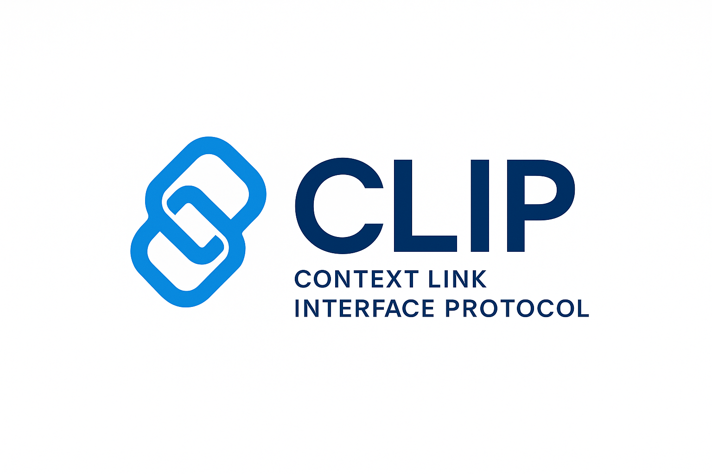

# CLIP Toolkit

<div align="center">
  
</div>

[](LICENSE)
[](https://github.com/clip-organization/clip-toolkit/actions)
[](https://github.com/clip-organization/clip-toolkit/actions)

**SDKs and tools for CLIP—the Context Link Interface Protocol**

Open-source tools and SDKs for working with [CLIP (Context Link Interface Protocol)](https://github.com/clip-organization/spec). Includes JSON validators, encoder/decoder libraries, and command-line utilities for generating and consuming Clips.

## 🚀 Quick Start

### CLI Tool (Node.js)

```bash
# Install the CLI tool globally
npm install -g @clip-toolkit/encoder-cli

# Validate a CLIP JSON file
clip validate my-clip.json

# Generate a CLIP template
clip generate --type venue --output my-venue.json

# Get statistics about a CLIP file
clip stats my-clip.json
```

### Python SDK

```python
from clip_toolkit import CLIPValidator, CLIPFetcher

# Validate a CLIP object
validator = CLIPValidator()
result = validator.validate(clip_data)

if result.is_valid:
    print("✅ Valid CLIP!")
else:
    print("❌ Validation errors:", result.errors)

# Fetch and validate a remote CLIP
fetcher = CLIPFetcher()
clip_obj = fetcher.fetch("https://example.com/my-clip.json")
features = clip_obj.get_features()
```

## 📦 Packages

This monorepo contains the following packages:

- **[@clip-toolkit/encoder-cli](packages/encoder-cli/)** - Command-line tool for validating and generating CLIP files
- **[@clip-toolkit/decoder-lib](packages/decoder-lib/)** - Library for decoding visual CLIP representations *(placeholder)*
- **[clip-toolkit](packages/sdk-python/)** - Python SDK for CLIP validation and consumption

## 🛠️ Development

### Prerequisites

- Node.js 18+ and npm 9+
- Python 3.8+ (for Python SDK)
- Git

### Setup

```bash
# Clone the repository
git clone https://github.com/clip-organization/clip-toolkit.git
cd clip-toolkit

# Install dependencies for all packages
npm install

# Build all packages
npm run build

# Run tests
npm run test
```

### Package Development

Each package can be developed independently:

```bash
# Work on the CLI tool
cd packages/encoder-cli
npm run dev

# Work on the Python SDK
cd packages/sdk-python
pip install -e ".[dev]"
pytest
```

## 📖 Documentation

- [CLIP Specification](https://github.com/clip-organization/spec) - The official CLIP standard
- [API Documentation](docs/) - Detailed API references
- [Examples](examples/) - Usage examples for each package
- [Contributing Guide](CONTRIBUTING.md) - How to contribute to the project

## 🎯 Roadmap

### Current (v0.1)
- ✅ Basic CLI validation and generation
- ✅ Python SDK with validation and fetching
- ✅ Comprehensive test suites

### Upcoming (v0.2)
- 🔄 Remote CLIP validation
- 🔄 Batch processing support
- 🔄 Enhanced error reporting
- 🔄 Performance optimizations

### Future
- 🎯 Visual encoding/decoding (QR codes, HexMatrix)
- 🎯 Go and Rust SDKs
- 🎯 MCP (Model Context Protocol) integration
- 🎯 CLIP registry and discovery service

## 🤝 Contributing

We welcome contributions! Please see our [Contributing Guide](CONTRIBUTING.md) for details.

1. Fork the repository
2. Create a feature branch (`git checkout -b feature/amazing-feature`)
3. Make your changes
4. Add tests and ensure they pass
5. Submit a pull request

### Development Guidelines

- Follow the existing code style
- Add tests for new features
- Update documentation as needed
- Ensure all CI checks pass

## 📄 License

This project is licensed under the MIT License - see the [LICENSE](LICENSE) file for details.

## 🔗 Links

- **CLIP Specification**: [github.com/clip-organization/spec](https://github.com/clip-organization/spec)
- **Example CLIP Files**: [github.com/clip-organization/spec/examples](https://github.com/clip-organization/spec/tree/main/examples)
- **Website**: [clipprotocol.org](https://clipprotocol.org) *(coming soon)*
- **Discussion**: [GitHub Discussions](https://github.com/clip-organization/clip-toolkit/discussions)

---

*Making it trivial for any developer to validate, generate, and consume CLIP objects. Built for the AI-first world.*
